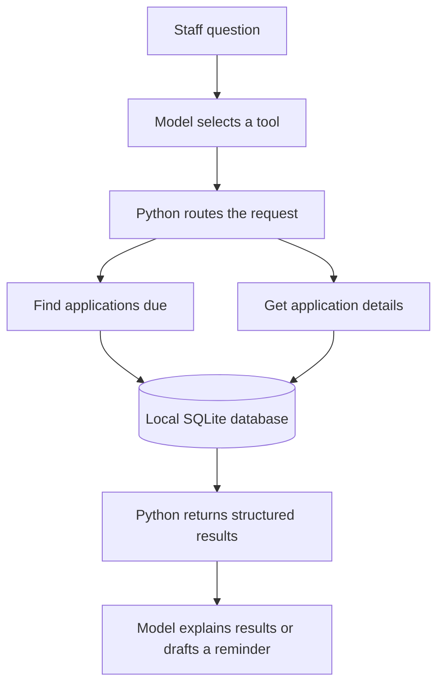
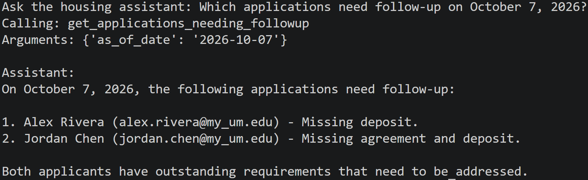
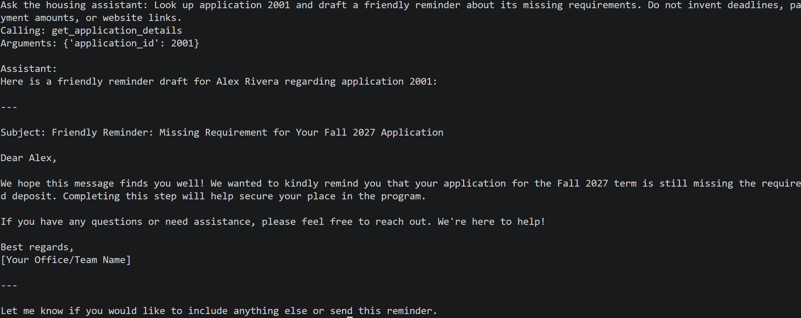

# housing_agent_demo
A simple demonstration of using OpenAI's API along with fictional data for student housing applications.
# Housing Application Follow-Up Assistant

A Python demo that combines SQL-based follow-up rules with an AI assistant. Staff can ask which housing applications need attention, inspect a specific application, or request a draft reminder in plain English.

This personal learning project uses entirely fictional student records. It is not connected to UM Housing, StarRez, Banner, or any university system. The requirements and follow-up intervals are invented for the demo.

## What it demonstrates

- A relational SQLite database linking students, applications, and reminder history.
- Python functions that query records and apply explicit follow-up rules.
- OpenAI function calling to select a tool and supply structured arguments.
- Answers and draft reminders grounded in retrieved database results.
- Visible terminal output showing the selected tool, arguments, and returned records.

The database functions determine eligibility. The model interprets the user's question, requests an available function, and explains its results. Reminder drafting uses the model's text-generation capability; it does not send a message.

## How it works



The first API request includes the question and tool descriptions. Python executes the requested function locally. A second API request returns those results to the model, linked to the original request, for a plain-English answer. The database file stays local; retrieved fictional records are sent to the API.

## Available tools

| Function | Input | Result |
| --- | --- | --- |
| `get_applications_needing_followup` | `as_of_date`, formatted as `YYYY-MM-DD` | Incomplete applications due for follow-up, with missing requirements and reminder information |
| `get_application_details` | Integer `application_id` | Current application details, all recorded reminders, and the next follow-up due date; or a not-found result |

Python routes requests only to these named functions. The model does not generate or execute arbitrary SQL.

## Demo rules and data

An application is incomplete if its agreement or deposit is missing. Its first follow-up becomes due three days after submission. After a recorded reminder, the next follow-up becomes due three days after that reminder. A complete application has no next follow-up date.

| Student | Application ID | Submitted | Agreement | Deposit | Latest reminder |
| --- | --- | --- | --- | --- | --- |
| Alex Rivera | 2001 | 2026-10-01 | Received | Missing | 2026-10-04 |
| Jordan Chen | 2002 | 2026-10-02 | Missing | Missing | None |
| Taylor Brooks | 2003 | 2026-10-03 | Received | Received | None |

On **October 6, 2026**, Jordan is due for follow-up. On **October 7, 2026**, both Alex and Jordan are due. Taylor is complete and is excluded from the follow-up report.

The schema has three tables:

- `students`: student ID, name, and email.
- `applications`: application ID, student ID, term, submission date, and requirement flags.
- `followups`: reminder ID, application ID, and reminder date.

Each application references a student. Each reminder references an application. The demo allows one application per student per term.

## Project files

| File | Purpose |
| --- | --- |
| `create_database.py` | Creates the three database tables |
| `seed_students.py` | Inserts fictional students |
| `seed_applications.py` | Inserts example applications |
| `seed_followups.py` | Inserts simulated reminder history |
| `housing_tools.py` | Contains the two reusable database functions |
| `followup_report.py` | Prints a report without using an LLM |
| `housing_agent.py` | Accepts a question, handles a tool request, and prints the model's answer |
| `test_openai.py` | Makes a small API connectivity test |
| `housing.db` | Locally generated SQLite database; excluded from version control |

## Setup

Developed using VS Code connected to WSL. Run the following commands in a Bash terminal from the project directory. Use Python 3.9 or newer and an OpenAI API account with available API credit or billing.

### 1. Create the Python environment

```bash
python3 -m venv .venv
source .venv/bin/activate
python -m pip install openai
```

SQLite is included with Python through the `sqlite3` standard-library module. The current agent code uses `gpt-4.1-mini` and the OpenAI Responses API.

### 2. Configure your API key

Create a key in your [OpenAI API account](https://platform.openai.com/api-keys). Enter these commands one at a time:

```bash
read -rsp "Paste your OpenAI API key: " OPENAI_API_KEY
export OPENAI_API_KEY
printf '\n'
```

Paste the key at the prompt and press Enter. The input is hidden. This sets the key for the current terminal session without putting its value into a command or Python file.

Check that Python can see it without displaying the key:

```bash
python -c "import os; print('Key configured' if os.getenv('OPENAI_API_KEY') else 'Key missing')"
```

The scripts read the environment variable directly; they do not automatically load a `.env` file. Reconfigure the key when opening a new terminal. Model requests incur API usage charges.

### 3. Create and populate the database

Run these scripts in order:

```bash
python create_database.py
python seed_students.py
python seed_applications.py
python seed_followups.py
```

The seed scripts skip existing records with matching primary IDs, so rerunning them does not duplicate those records or reset edited values. `CREATE TABLE IF NOT EXISTS` does not migrate an existing table when its definition changes.

### 4. Run the demo

For a SQL-based report without an API call:

```bash
python followup_report.py
```

The report date is set inside that script. Set it to `2026-10-06` to reproduce the first example above.

For the AI assistant:

```bash
python housing_agent.py
```

Enter one question at the prompt. Run the script again for another question.

## Example questions

```text
Which housing applications need follow-up as of October 7, 2026?
```

Expected tool: `get_applications_needing_followup`. Expected result: Jordan Chen and Alex Rivera.

```text
Look up application 2001 and draft a friendly reminder about its missing requirements. Do not invent deadlines, payment amounts, or website links.
```

Expected behavior: retrieve the application and draft a message about the missing deposit. The wording may vary. No email is sent and no reminder record is created.

## Screenshots


### Finding applications due for follow-up



### Drafting a reminder

 

## Current scope and limitations

- This is a command-line prototype with three fictional students, not a deployed housing service.
- Each run handles one question. There is no persistent conversation memory; clarification requires rerunning with a complete question.
- There is one round of tool execution. The final response request has no tools, so the model cannot make additional dependent queries during that response.
- Application details require an application ID. Searching by student name is not implemented.
- Queries use current requirement flags and all stored reminders. The supplied date is a cutoff for the current data, not a reconstruction of historical application status. The database does not retain requirement-change history.
- The agent tools retrieve data only. There is no email delivery, scheduled execution, or application update capability.
- API error recovery, authentication for housing staff, and production monitoring have not been implemented.
- Generated text should be reviewed for accuracy before use. A future production integration would need approved system access, appropriate handling of student information, and institution-specific business rules.

## Keeping the repository reproducible

Include the Python scripts and this README. Create a `.gitignore` containing:

```gitignore
.venv/
.env
.env.*
!.env.example
__pycache__/
*.pyc
housing.db
housing.db-*
```

Do not commit API keys or real student information. Review screenshots for secrets before adding them. The seed scripts reproduce the fictional database, so the database file itself does not need to be published.

## Possible next steps

- Add a student search tool and a larger fictional dataset.
- Support multiple tool rounds and conversational follow-up questions.
- Centralize the waiting-period rule shared by both database functions.
- Add tests for date boundaries, missing IDs, and complete applications.
- Add a staff review interface for reminder drafts.

## Author

Jaylene Naylor

